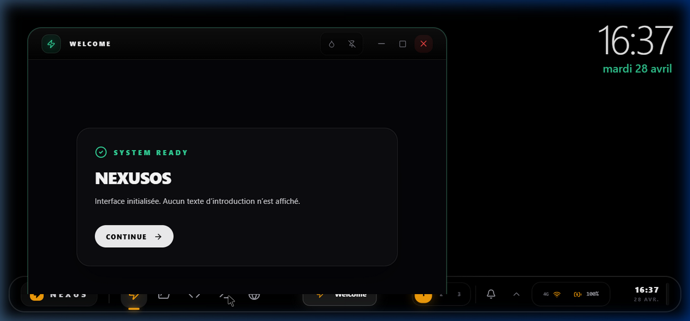
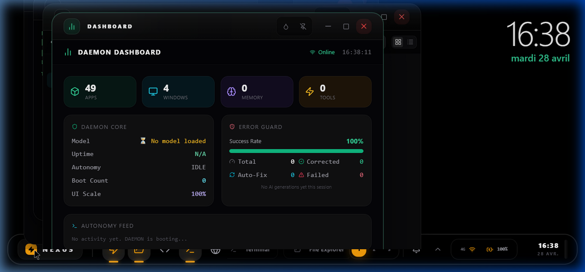
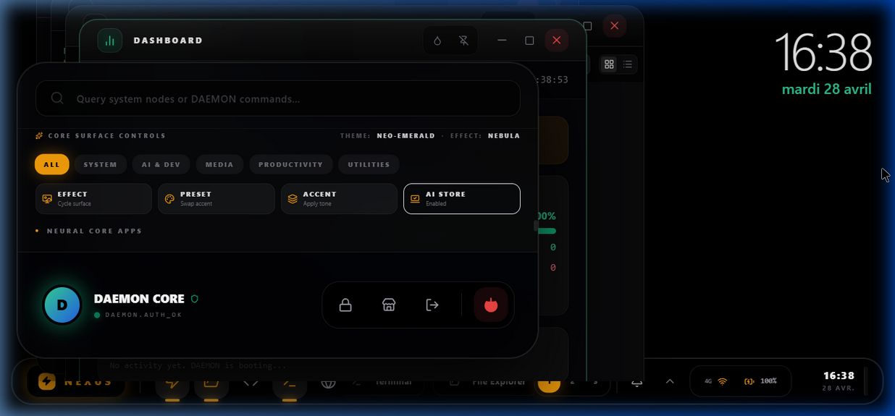

<div align="center">
  
</div>

<h1 align="center">NexusOS v2.0</h1>
<h3 align="center">The Self-Evolving AI Operating System</h3>

<div align="center">
  <p><em>An operating system that doesn't just run software — it thinks, adapts, and rewrites itself.</em></p>
</div>

<div align="center">
  <a href="https://github.com/AFKmoney/nexusOS/releases"></a>
  <a href="https://github.com/AFKmoney/nexusOS/stargazers"></a>
  
  
  
</div>

<br/>

---

## The Problem

Every "AI-powered" tool today follows the same pattern: a chatbot pasted on top of a static application. The AI can answer questions. It cannot **act**. It cannot observe the system it lives in. It cannot learn from your behavior. It cannot fix itself when it breaks.

You are still the operator. The AI is still a passenger.

## The Solution

**NexusOS is the first operating system where AI is not a feature — it is the kernel.**

At the core of NexusOS lives **DAEMON** — an autonomous intelligence engine woven directly into the file system, the process manager, and the shell. DAEMON doesn't wait for your commands. It observes, decides, and acts — autonomously opening applications, organizing your workspace, building entire apps from natural language, and self-healing when something breaks.

Every action DAEMON takes is logged, governed, and reversible. You remain sovereign. But the OS is alive.

---

## 🖥️ Screenshots

<div align="center">

### DAEMON Dashboard

<p><em>DAEMON Dashboard — 49 apps, real-time system metrics, ErrorGuard, and autonomy feed</em></p>

### Desktop & Start Menu

<p><em>Start Menu with category filters, app grid, theme controls, and DAEMON status</em></p>

### Multi-Window Environment

<p><em>Multiple windows, glassmorphic taskbar, workspace switcher, and system tray</em></p>

</div>

---

## ⚡ Core Capabilities

| Capability | What It Does |
|---|---|
| 🧠 **DAEMON Autonomy Engine** | Mission-based AI agent with event-driven reactivity, system snapshots, and 21 OS action protocols |
| 🔄 **Self-Healing Architecture** | Crashed app? DAEMON reads its own faulty code, writes a patch, and recompiles — live |
| 💻 **HyperIDE** | Full code editor with syntax highlighting, integrated terminal, and AI co-pilot |
| 🔧 **Neural Forge** | Describe any app → DAEMON builds the complete React codebase and injects it into the VFS |
| 📟 **DAEMON Terminal** | 30+ Unix commands, pipes, redirection, environment variables, aliases, and shell history |
| 🌐 **NetRunner** | AI-augmented browser with semantic snapshots and autonomous web navigation |
| 📁 **Virtual File System** | POSIX-like VFS with directories, permissions, symlinks, search, undo/redo, and event emission |
| 👻 **Ghost Mode** | DAEMON silently optimizes your workspace by tracking usage patterns — no interaction required |
| 🔒 **100% Local Inference** | All AI runs locally via GGUF models (Wllama) or LM Studio. Zero cloud dependency. Zero telemetry |
| 🎨 **50+ Built-in Applications** | Calculator, Notepad, Calendar, Music Player, Paint, Weather, Kanban, Password Manager, and more |
| ⚙️ **Plugin Architecture** | Extensible hook-based system for registering custom apps, commands, and OS actions |
| 🗓️ **Cron Scheduling** | DAEMON schedules and executes recurring system tasks with persistent cron expressions |

---

## 🧠 DAEMON — The Intelligence Layer

DAEMON is not a chatbot. It is an **autonomous agent** embedded at the kernel level of NexusOS.

```
DAEMON Control Surface (v2.0)
├── Autonomy Engine ─────── Mission scoring, system snapshots, periodic reflection
├── Command Engine ──────── 30+ Unix shell commands with pipes, redirection, aliases
├── Tool Forge ──────────── 21 OS action protocols for window, file, and app control
├── Event Bus ───────────── Pub/sub reactivity across shell, kernel, and services
├── Self-Healing Watchdog ─ Heartbeat monitoring with automatic restart on crash
├── Context Journal ─────── Persistent memory at /system/.daemon/journal/
├── Ghost Mode v2 ───────── Pattern-based workspace optimization (silent, autonomous)
├── AI Pipeline ─────────── Task queueing with capability labels and status tracking
├── Context Router ──────── Dynamic context enrichment from VFS, memory, and active app
└── Cron Scheduler ──────── Persistent background task scheduling
```

### What DAEMON Can Do

- **Observe** the entire system state — open windows, files, processes, memory usage
- **Decide** which actions to take based on mission scoring and system snapshots
- **Act** — open/close apps, read/write/delete/move files, build entire applications
- **Reflect** — write journal entries, compress memories, update its own context
- **Self-heal** — detect crashes, read faulty code, generate patches, recompile live
- **Learn** — embed every action and context into a local fractal vector space for recall

### Autonomy Governance

DAEMON operates under a strict governance model:

- **Kill-switch**: Autonomy can be disabled instantly via `kernelRules.autonomyEnabled`
- **Permission boundaries**: VFS operations require explicit `appId` and capability checks
- **Audit trail**: Every autonomous action is logged with timestamps and outcomes
- **Human override**: The user can pause, deny, inspect, or disable autonomy at any time
- **Safe mode**: System degrades gracefully when confidence is lost

> Full governance architecture: [SAFE_SELF_EVOLUTION_SPEC.md](docs/SAFE_SELF_EVOLUTION_SPEC.md) · [AI_GOVERNANCE_GAP_ANALYSIS.md](docs/AI_GOVERNANCE_GAP_ANALYSIS.md) · [AUTONOMY_ROADMAP.md](docs/AUTONOMY_ROADMAP.md)

---

## 📥 Installation

### Option 1: Windows Installer (Recommended)

1. Go to the [**Releases Page**](https://github.com/AFKmoney/nexusOS/releases)
2. Download `NexusOS_Setup_2.0.0.exe`
3. Run the installer — follow the setup wizard
4. Launch **NexusOS** from your Start Menu or Desktop shortcut

> **Note**: Windows SmartScreen may show a warning since the app isn't code-signed yet. Click **"More info"** → **"Run anyway"** to proceed.

### Option 2: Run from Source (Developer)

```bash
# Clone the repository
git clone https://github.com/AFKmoney/nexusOS.git
cd nexusOS

# Install dependencies
npm install

# Run in development mode (browser)
npm run dev

# Or build the Windows installer
npm run build
npx electron-builder --win
```

### Option 3: Web Version (No Install)

NexusOS runs entirely in the browser. After cloning and running `npm run dev`, open `http://localhost:5173` in any modern browser.

---

## 🛠️ Technology

| Layer | Stack |
|---|---|
| **Frontend** | React 19, TypeScript, Zustand |
| **Build** | Vite 6.4, Electron (desktop), electron-builder |
| **AI (Local)** | Wllama (GGUF in-browser inference), LM Studio (OpenAI-compatible) |
| **AI (Cloud)** | Puter.js API (optional fallback) |
| **Installer** | NSIS (Windows) |

---

## 🗂️ Architecture

```
nexusOS/
├── App.tsx                  # Shell orchestrator
├── store/osStore.ts         # Global state (Zustand) — session, windows, autonomy, theme
├── kernel/
│   ├── autonomy.ts          # AI autonomy engine — missions, snapshots, reflection
│   ├── commander.ts         # Unix shell — 30+ commands, pipes, redirection
│   ├── daemonBridge.ts      # DAEMON neural link — heartbeat, watchdog, journal
│   ├── eventBus.ts          # Pub/sub event system
│   ├── fileSystem.ts        # Virtual file system — POSIX-like, permission-gated
│   ├── memory.ts            # Persistent fractal memory — vector embeddings, recall
│   ├── toolForge.ts         # OS action protocols (21 actions)
│   ├── processManager.ts    # Process lifecycle — spawn, kill, memory tracking
│   ├── permissions.ts       # App permission model — vfs.read, vfs.write, network, kernel.modify
│   ├── aiPipeline.ts        # AI task queueing with capabilities
│   ├── aiContextRouter.ts   # Dynamic context enrichment
│   └── cronScheduler.ts     # Background task scheduling
├── services/
│   ├── localBrain.ts        # Local GGUF inference — Wllama, LM Studio
│   ├── puterService.ts      # Cloud AI fallback
│   └── daemonLogic.ts       # Fractal knowledge graph
├── apps/                    # 52 built-in applications
├── components/              # Shell UI — Taskbar, StartMenu, WindowManager, LockScreen
└── electron-main.cjs        # Electron main process — IPC, native commands, model downloads
```

> Full architecture deep-dive: [ARCHITECTURE.md](ARCHITECTURE.md)

---

## 📖 Documentation

| Document | Description |
|---|---|
| [**ARCHITECTURE.md**](ARCHITECTURE.md) | Full system architecture — shell, kernel, state, services, native layer |
| [**USER_MANUAL.md**](USER_MANUAL.md) | Complete user guide — features, shortcuts, theming, DAEMON interaction |
| [**CONTRIBUTING.md**](CONTRIBUTING.md) | How to contribute — setup, workflow, coding standards |
| [**TESTING.md**](TESTING.md) | Test infrastructure — commands, coverage, priorities |
| [**BUILD_AND_RELEASE.md**](BUILD_AND_RELEASE.md) | Build pipeline — web, Electron, packaging, validation |
| [**PERMISSIONS_MODEL.md**](PERMISSIONS_MODEL.md) | Permission system — types, API, VFS integration |
| [**VFS_SPEC.md**](VFS_SPEC.md) | Virtual file system specification — storage, paths, operations, events |
| [**SYSTEM_AUDIT_ZMSFA.md**](SYSTEM_AUDIT_ZMSFA.md) | ZMSFA framework audit — fractal scheduler, torus memory, mirror guard |

### Advanced / Research

| Document | Description |
|---|---|
| [**SAFE_SELF_EVOLUTION_SPEC.md**](docs/SAFE_SELF_EVOLUTION_SPEC.md) | Self-evolution governance — propose, validate, test, stage, deploy, rollback |
| [**AI_GOVERNANCE_GAP_ANALYSIS.md**](docs/AI_GOVERNANCE_GAP_ANALYSIS.md) | Gap analysis — what exists vs what's needed for safe autonomy |
| [**AUTONOMY_ROADMAP.md**](docs/AUTONOMY_ROADMAP.md) | 9-phase roadmap from AI-assisted shell to self-evolving OS |
| [**NexusOS_Book_Outline.md**](docs/NexusOS_Book_Outline.md) | Full technical manual outline — 34 chapters across 11 parts |

---

## 🏗️ Roadmap

NexusOS is evolving through a phased autonomy roadmap:

| Phase | Status | Goal |
|---|---|---|
| **Phase 0** — Control Baseline | ✅ Complete | Action taxonomy, kill-switch, audit trail |
| **Phase 1** — Observability | ✅ Complete | Decision logging, autonomy status model |
| **Phase 2** — Policy Engine | 🔄 In Progress | Permission boundaries, approval gates |
| **Phase 3** — Proposal Loop | 🔜 Next | Structured proposals before mutation |
| **Phase 4** — Test-before-Stage | ⬚ Planned | Validation pipeline with build/typecheck/test gates |
| **Phase 5** — Staging & Deploy | ⬚ Planned | Isolated staging, explicit promotion |
| **Phase 6** — Rollback & Recovery | ⬚ Planned | State snapshots, guaranteed revert |
| **Phase 7** — Anomaly Detection | ⬚ Planned | Health metrics, confidence scoring |
| **Phase 8** — Safe Self-Evolution | ⬚ Planned | Tiered trust, sandboxed code mutation |
| **Phase 9** — Human Override | ⬚ Planned | Kill-switch, emergency pause, incident mode |

> Full roadmap: [AUTONOMY_ROADMAP.md](docs/AUTONOMY_ROADMAP.md)

---

## 🤝 Contributing

Contributions are welcome. See [CONTRIBUTING.md](CONTRIBUTING.md) for guidelines.

```bash
# Fork the repo, create a branch
git checkout -b feature/my-feature

# Make changes, then validate
npm run typecheck       # Type safety
npm test                # Kernel tests
npm run build           # Production build

# Commit and push
git commit -m "feat: my feature"
git push origin feature/my-feature
```

---

## 📜 License

MIT — See [LICENSE](LICENSE)

---

<div align="center">
  <br/>
  <b>Architected by Philippe-Antoine Robert</b><br/>
  <em>"The cloud is a shadow. The code is the light."</em><br/><br/>
  <a href="https://github.com/AFKmoney/nexusOS/stargazers">⭐ Star this repo to awaken the DAEMON ⭐</a>
</div>