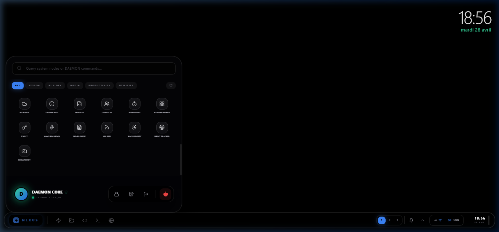
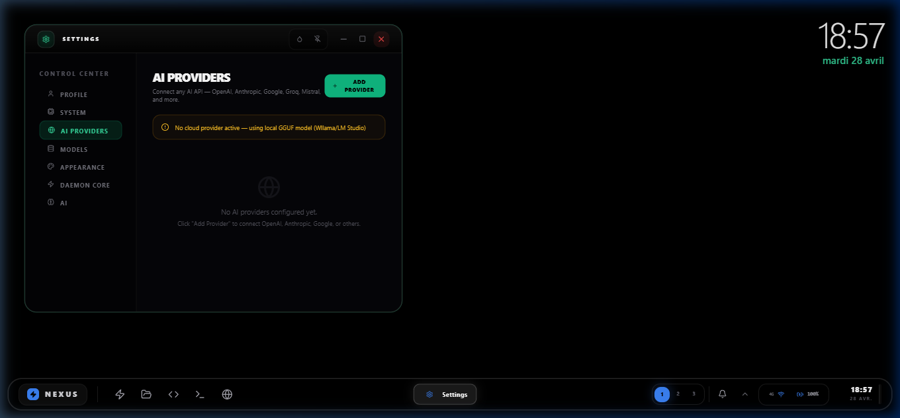
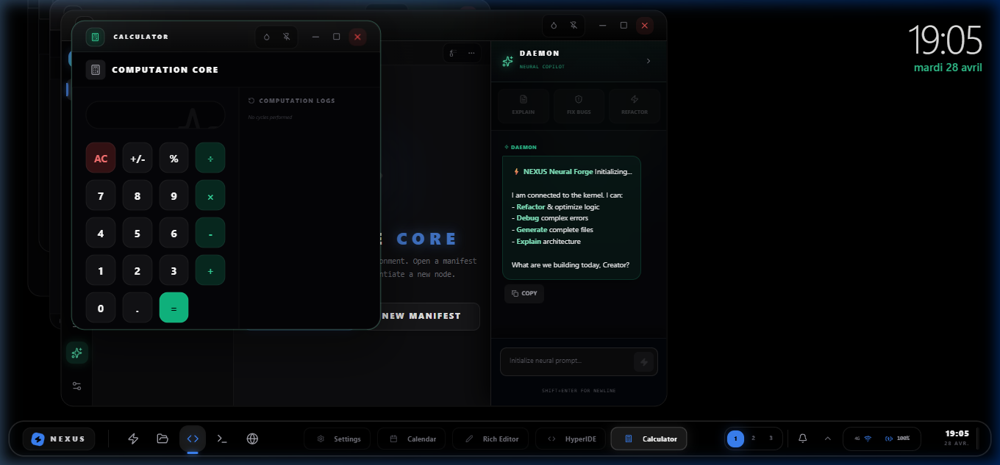
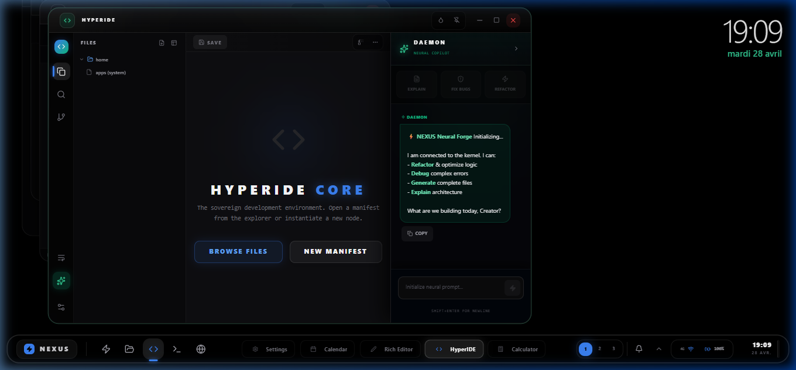

<div align="center">
  
</div>

<h1 align="center">NexusOS v2.0</h1>
<h3 align="center">The AI-Native Operating System</h3>

<div align="center">
  <p><em>A browser-based operating system with an AI engine at its core — capable of building apps, managing files, and evolving autonomously.</em></p>
</div>

<div align="center">
  <a href="https://github.com/AFKmoney/nexusOS/releases"></a>
  <a href="https://github.com/AFKmoney/nexusOS/stargazers"></a>
  
  
</div>

<br/>

---

## What is NexusOS?

NexusOS is a **full desktop operating system** that runs entirely in your browser. It ships with 49 native applications, a virtual file system, window management, multi-workspace support, and an integrated AI engine called **DAEMON** that can interact with every layer of the OS.

Unlike traditional AI integrations, DAEMON is not a chatbot sidebar — it's embedded in the kernel. It can open applications, read and write files, build new apps from natural language, and detect errors in its own output.

---

## 🖥️ Screenshots

<div align="center">

### Desktop

<p><em>Desktop with glassmorphic taskbar, system tray, workspace switcher, and live clock</em></p>

### Start Menu

<p><em>49 apps organized by category — AI & Dev, System, Media, Productivity, Utilities</em></p>

### AI Provider Configuration

<p><em>Connect OpenAI, Anthropic, Google, Groq, Mistral, or run offline with GGUF models</em></p>

### Multi-Window + AI Copilot

<p><em>Calculator, HyperIDE, and DAEMON Copilot running simultaneously</em></p>

### HyperIDE — Code Editor

<p><em>IDE with file explorer, syntax highlighting, and integrated AI copilot</em></p>

</div>

---

## ⚡ Core Capabilities

| Capability | Description |
|---|---|
| 🧠 **DAEMON Engine** | Autonomous AI agent with 21 OS-level action protocols |
| 🔄 **Self-Healing** | ErrorGuard detects and patches malformed AI output before it reaches the UI |
| 💻 **HyperIDE** | Code editor with syntax highlighting, file explorer, and AI copilot |
| 🔧 **Neural Forge** | Describe an app in natural language → DAEMON builds the complete React component |
| 📟 **Terminal** | 30+ Unix commands with pipes, redirection, aliases, and environment variables |
| 🌐 **NetRunner** | Built-in browser with semantic snapshots |
| 📁 **Virtual File System** | POSIX-like VFS with permissions, symlinks, search, and undo/redo |
| 🎨 **49 Built-in Apps** | Calculator, Notepad, Calendar, Music Player, Paint, Weather, Kanban, and more |
| 🔌 **Multi-Provider AI** | OpenAI, Anthropic, Google, Groq, Mistral, Ollama, LM Studio, or offline GGUF |
| ⚙️ **Plugin System** | Extensible architecture for custom apps, commands, and OS actions |
| 🗓️ **Cron Scheduler** | Background task scheduling with persistent expressions |

---

## 🧠 DAEMON — The Intelligence Layer

DAEMON is an **autonomous agent** embedded at the kernel level. It doesn't just respond to prompts — it executes system actions:

```
OS::OPEN_APP:calculator          → Opens an application
OS::WRITE_FILE:/home/readme.md   → Creates or updates a file
OS::BUILD_APP:{...}              → Generates a new React component
OS::NOTIFY:Task complete         → Sends a system notification
OS::SET_WALLPAPER:nebula         → Changes the desktop wallpaper
```

### Adaptive Context Engine

DAEMON uses a **3-tier manifest system** that dynamically adjusts context injection based on query complexity:

| Tier | Trigger | Token Budget |
|------|---------|-------------|
| Minimal | General chat | ~80 tokens |
| Standard | System queries | ~300 tokens |
| Full | OS operations | ~500 tokens |

This makes NexusOS compatible with small models (1-3B parameters) without sacrificing capability.

### Governance

- **Kill-switch**: Autonomy can be disabled instantly
- **Permission boundaries**: All VFS operations require capability checks
- **Audit trail**: Every action is logged with timestamps
- **Human override**: Users can pause, deny, or disable autonomy at any time

---

## 📥 Installation

### Quick Start (Browser)

```bash
git clone https://github.com/AFKmoney/nexusOS.git
cd nexusOS
npm install
npm run dev
```

Open `http://localhost:3000`. No backend required.

### Windows Desktop App

1. Go to [**Releases**](https://github.com/AFKmoney/nexusOS/releases)
2. Download `NexusOS_Setup_2.0.0.exe`
3. Run the installer

> Windows SmartScreen may show a warning (app is not code-signed yet). Click **"More info"** → **"Run anyway"**.

### AI Setup (Optional)

1. Open **Settings → AI Providers**
2. Add an API key (OpenAI, Anthropic, Google, etc.)
3. Or: Open **Model Manager** and download a GGUF model for offline use

---

## 🛠️ Technology

| Layer | Stack |
|---|---|
| **Frontend** | React 19, TypeScript, Zustand |
| **Build** | Vite 6.4, Electron (desktop) |
| **AI (Cloud)** | OpenAI, Anthropic, Google, Groq, Mistral, OpenRouter |
| **AI (Local)** | Wllama (GGUF), LM Studio, Ollama |
| **Packaging** | electron-builder, NSIS (Windows) |

---

## 🗂️ Project Structure

```
nexusOS/
├── App.tsx                  # Shell orchestrator
├── store/osStore.ts         # Global state (Zustand)
├── kernel/
│   ├── autonomy.ts          # AI autonomy engine
│   ├── commander.ts         # Unix shell (30+ commands)
│   ├── daemonBridge.ts      # DAEMON lifecycle management
│   ├── eventBus.ts          # Pub/sub event system
│   ├── fileSystem.ts        # Virtual file system
│   ├── memory.ts            # Persistent memory with recall
│   ├── toolForge.ts         # OS action protocols (21 actions)
│   ├── osManifest.ts        # Adaptive context engine (3-tier)
│   ├── processManager.ts    # Process lifecycle
│   ├── permissions.ts       # App permission model
│   └── cronScheduler.ts     # Background task scheduling
├── services/
│   ├── localBrain.ts        # Local GGUF inference
│   ├── puterService.ts      # AI routing and prompt management
│   ├── aiProviders.ts       # Multi-provider gateway
│   └── errorGuard.ts        # Self-healing output validation
├── apps/                    # 49 built-in applications
├── components/              # Shell UI components
└── electron-main.cjs        # Electron main process
```

---

## 📖 Documentation

| Document | Description |
|---|---|
| [**ARCHITECTURE.md**](ARCHITECTURE.md) | System architecture — shell, kernel, services, state |
| [**USER_MANUAL.md**](USER_MANUAL.md) | User guide — features, shortcuts, theming, AI interaction |
| [**CONTRIBUTING.md**](CONTRIBUTING.md) | Contribution guide — setup, workflow, coding standards |
| [**TESTING.md**](TESTING.md) | Test infrastructure and commands |
| [**BUILD_AND_RELEASE.md**](BUILD_AND_RELEASE.md) | Build pipeline — web, Electron, packaging |
| [**VFS_SPEC.md**](VFS_SPEC.md) | Virtual file system specification |

---

## 🏗️ Roadmap

| Phase | Status | Goal |
|---|---|---|
| **Phase 0** — Foundation | ✅ Complete | 49 apps, VFS, window management, AI engine |
| **Phase 1** — Observability | ✅ Complete | Decision logging, autonomy status, audit trail |
| **Phase 2** — Policy Engine | 🔄 In Progress | Permission boundaries, approval gates |
| **Phase 3** — Proposal Loop | 🔜 Next | Structured proposals before code mutation |
| **Phase 4** — Sandboxed Execution | ⬚ Planned | Isolated environment for AI-generated code |
| **Phase 5** — Plugin Marketplace | ⬚ Planned | Community-built apps installable from the App Store |
| **Phase 6** — Collaborative Workspaces | ⬚ Planned | Multi-user sessions |
| **Phase 7** — Mobile PWA | ⬚ Planned | Full NexusOS on mobile devices |

---

## 🤝 Contributing

Contributions are welcome. See [CONTRIBUTING.md](CONTRIBUTING.md) for guidelines.

```bash
git checkout -b feature/my-feature

npm run typecheck       # Type safety
npm test                # Kernel tests
npm run build           # Production build

git commit -m "feat: my feature"
git push origin feature/my-feature
```

---

## 📜 License

MIT — See [LICENSE](LICENSE)

---

<div align="center">
  <br/>
  <b>Created by Philippe-Antoine Robert</b><br/>
  <a href="https://github.com/AFKmoney/nexusOS/stargazers">⭐ Star this project on GitHub</a>
</div>